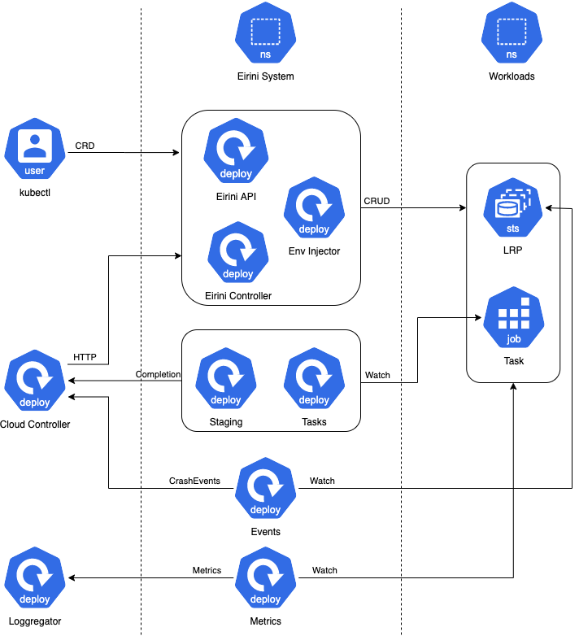

<h1 align="center">
  
</h1>

<!-- A spacer -->

&nbsp;

## What is Eirini?

_Eirini_ is a Kubernetes backend for Cloud Foundry. It deploys CF applications
to a Kubernetes backend, using OCI images and Kubernetes `StatefulSet`s.

Since scheduling is increasingly commoditized, Eirini provides an _Orchestrator
Provider Interface (OPI)_ layer, that abstracts away orchestration from Cloud
Foundry's control plane. This means Eirini is not solely a Kube backend at all,
but that it is a generic backend for any scheduler! This means it could
schedule to Diego, Kubernetes, Swarm and other orchestration providers, as long
as there is an implementation of the OPI layer for the target platform.

To offer a generic orchestrator interface, Eirini uses the Diego abstractions
of _Long Running Processes (LRPs)_ and _Tasks_ to capture Cloud Foundry's
notion of long running processes and one-off tasks.

Deployment instructions are available at:
[cloudfoundry-incubator/eirini-release](https://github.com/cloudfoundry-incubator/eirini-release).

## Orchestrator Provider Interface (OPI)

The really great thing about Diego is the high level abstractions above the
level of containers and pods. Specifically, these are _Long Running Processes
(LRPs)_ and _Tasks_. Actually, LRPs and Tasks are most of what you need to
build a PaaS, and they're cross-cutting concepts that map nicely to all current
orchestrators (for example to LRPs/Tasks directly in Diego, to Deployments/Jobs
in Kube, and to Services/Containers in Swarm).

Currently Eirini strictly provides a Kubernetes implementation of the OPI.
However, this can be easily extended to support other orchestration platforms.

## Components

---

Eirini is composed of:

- `opi`: The main component, provides the REST API (implementing OPI) used by
  the [Cloud Controller](https://github.com/cloudfoundry/cloud_controller_ng/).
  It's responsible for starting LRPs and tasks.

- `event-reporter`: A Kubernetes reconciler that watches for LRP instance
  crashes and reports them to the [Cloud
  Controller](https://github.com/cloudfoundry/cloud_controller_ng/).

- `instance-index-env-injector`: A Kubernetes webhook that inserts the
  [`CF_INSTANCE_INDEX`](https://docs.cloudfoundry.org/devguide/deploy-apps/environment-variable.html#CF-INSTANCE-INDEX)
  environment variable into every LRP instance (pod).

- `metrics-collector`: A component that collects metric usage for all LRPs and
  reports it to the
  [Loggregator](https://github.com/cloudfoundry/loggregator-release) component.

- `route-collector`: A component that continuously collects routes and
  registers them in [Gorouter](https://github.com/cloudfoundry/gorouter) using
  [NATS](https://nats.io/). Usually deployed in combination with
  `route-pod-informer` and `route-statefulset-informer`.

- `route-pod-informer`: A Kubernetes informer that reacts to LRP scale (up &
  down) operations and registers/unregisters routes in
  [Gorouter](https://github.com/cloudfoundry/gorouter). Usually deployed in
  combination with `route-collector` and `route-statefulset-informer`.

- `route-statefulset-informer`: A Kubernetes informer that reacts to [`cf map-route`](https://cli.cloudfoundry.org/en-US/v6/map-route.html) and [`cf unmap-route`](https://cli.cloudfoundry.org/en-US/v6/unmap-route.html)
  operations and registers/unregisters routes in
  [Gorouter](https://github.com/cloudfoundry/gorouter). Usually deployed in
  combination with `route-collector` and `route-pod-informer`.

- `task-reporter`: A Kubernetes reconciler that reports the outcome of tasks to
  the [Cloud Controller](https://github.com/cloudfoundry/cloud_controller_ng/)
  and deletes the underlying Kubernetes Jobs after a configurable TTL has
  elapsed.

- `eirini-controller`: A Kubernetes reconciler that acts on
  create/delete/update operations on Eirini's own Custom Resouce Definitions
  (CRDs). This is still experimental.

## CI Pipelines

We use Concourse. Our pipelines can be found
[here](https://jetson.eirini.cf-app.com/).

## Contributing

Please read [CONTRIBUTING.md](.github/contributing.md) for details.

## Have a question or feedback? Reach out to us!

We can be found in our Slack channel
[#eirini-dev](https://cloudfoundry.slack.com/archives/C8RU3BZ26) in the Cloud
Foundry workspace. Please hit us up with any questions you may have or to share
your experience with Eirini!
